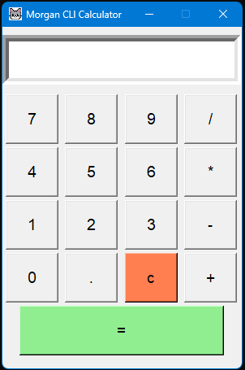

# 🧮 Morgan Calculator

Calculadora de escritorio construida con Python, interfaz gráfica con Tkinter y sonido con Pygame. Incluye ícono personalizado y fue empaquetada como ejecutable `.exe` con PyInstaller.

---

## 🛠️ Tecnologías utilizadas

- **Python** → Lenguaje principal
- **Tkinter** → Interfaz gráfica
- **Pygame** → Sonido al presionar botones
- **PyInstaller** → Empaquetado como ejecutable .exe

---

## ✨ Características

- Operaciones básicas: suma, resta, multiplicación y división
- Sonido al calcular resultado
- Ícono personalizado
- Ventana fija, diseño limpio
- Empaquetada como `.exe` ejecutable

---

## 📸 Captura



---

## 🚀 Cómo correr el proyecto

### Opción 1: Correr con Python

```bash
pip install pygame
python "Morgan Calculator.py"
```

### Opción 2: Ejecutable

Descarga el `.exe` y ejecuta directamente sin instalar Python.

---

## 📁 Archivos

| Archivo | Descripción |
|---------|-------------|
| `Morgan Calculator.py` | Código fuente principal |
| `click.wav` | Sonido al calcular |
| `Morgan.png` | Ícono de la ventana |
| `Morgancapt.png` | Captura de pantalla |

---

## 👨‍💻 Autor
**David Fernando Solano Garcia** - Analista de Datos & QA Junior  
[](https://www.linkedin.com/in/david-fernando-solano-garcia-840230348)
